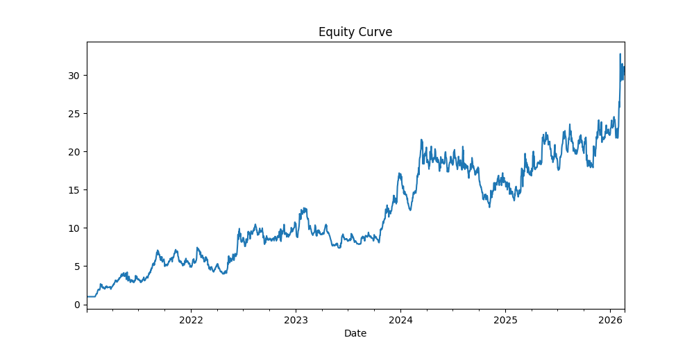
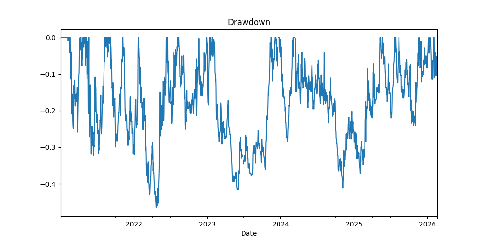

# Volatility-Adjusted Multi-Horizon Crypto Momentum Strategy

## Overview

This project implements a systematic crypto momentum trading strategy across BTC, ETH, BNB, and SOL using multi-horizon signal construction and risk-aware portfolio design.

The framework emphasizes realistic execution modeling, turnover control, and capital stability.

---

## Strategy Design

### 1. Signal Construction
- 7-day, 14-day, and 30-day rolling momentum
- Combined multi-horizon momentum to reduce single-window bias
- Volatility-adjusted scoring (momentum / rolling volatility)
- Score capping to control extreme exposures

### 2. Portfolio Construction
- Cross-asset weight normalization
- Exposure scaling (50%) for risk control
- High-volatility regime exposure reduction

### 3. Execution Modeling
- Weekly rebalancing
- Transaction cost modeling (0.1% per turnover unit)
- Fully dynamic backtest (no look-ahead bias)

---

## Performance Summary (Jan 2021– Feb 2026)

- Final Equity ≈ 5.17x
- Sharpe Ratio ≈ 1.08
- Max Drawdown ≈ -26%
- Positive Skew (~0.45)
- Fat-tailed distribution (kurtosis > 4)
- Average Turnover ≈ 6% per rebalance

---

## Key Insights

- Raw momentum performance deteriorates significantly after incorporating transaction costs.
- Turnover management materially improves net performance.
- Exposure scaling reduces drawdown while preserving risk-adjusted efficiency.
- Strategy performs best in trending regimes and is sensitive to sideways markets.

---

## Limitations

- Regime sensitivity (trend-dependent)
- Partial beta exposure to broad crypto markets
- Performance dependent on trend persistence

---

## Future Improvements

- Cross-sectional long-short extension
- Beta-hedging framework
- Walk-forward out-of-sample validation

---

## Strategy Performance

**Final Equity:** 5.17x  
**Sharpe Ratio:** 1.08  
**Max Drawdown:** -26%

### Equity Curve

### Drawdown

